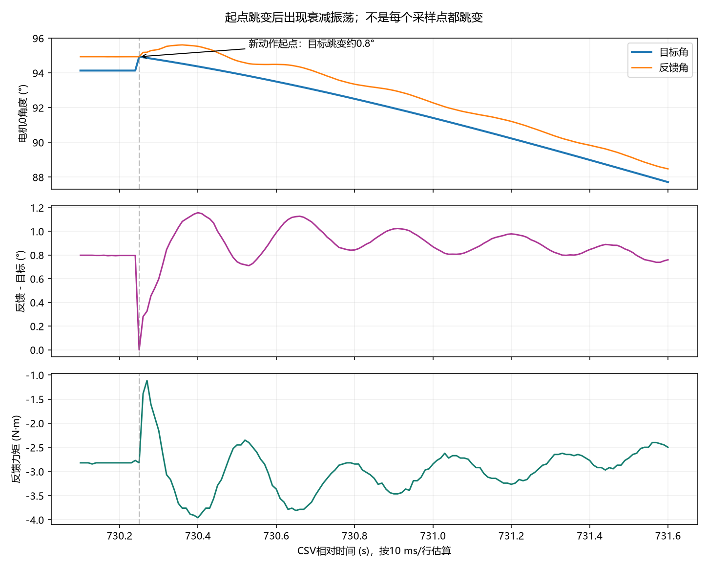

# 第三次 VOFA 波形：运动抖动分析

数据源：项目根目录 `第三次调试vofa+数据.csv`，共 76,343 行、6 列，未发现 NaN/Inf。原文件未修改。本次只分析数据和代码，没有修改电机控制参数、运动代码或烧录。

## 结论

最值得先处理的是新动作起点的目标跳变，其次是非零起步速度/加速度，再验证控制阻尼与机构柔性。波形支持“目标突变后激起振荡”，但不能单凭这六列判定全部抖动都是 PID 或机械问题。没有证据证明笛卡尔直线本身必须换掉。

## 时间与数据限制

CSV 没有 MCU 时间戳。图中时间按每行 10 ms、第一行为 0 s 估算，不能直接与 EventRecorder 的开机时间相等；不能用它测 1–2 ms 调度抖动，也无法排除丢帧或暂停。多数目标变化段接近 5 秒，不能把当前源代码的 2 秒动作时长套到这次记录上。图中力矩单位沿用当前工程的减速比换算，不是独立力矩传感器标定结果。

## 波形直接显示的现象

1. 约 730.25 s 新动作开始时，电机0目标从 1.642999 rad 跳至 1.656934 rad，跳变量 **0.7984°**。跳变前反馈为 1.656904 rad，目标与反馈之间原有 **0.7967°** 的偏差。因此新目标几乎正好被重置到反馈位置。
2. 同一时刻电机1目标也跳了 **−0.3561°**，跳变前偏差为 **−0.3544°**。两个通道都符合相同的起点处理方式。
3. 随后电机0误差反复起伏。局部峰值间隔约 **0.25、0.26、0.29 s**，即约 3.4–4 Hz；另一个运动段也见到约 0.24–0.27 s 的周期。频率只是按名义采样周期估算，不是机构固有频率的标定。
4. 起点附近反馈力矩从约 −2.8 N·m 变到约 −1.1 N·m，随后摆到约 −4 N·m，再来回衰减。误差与力矩同步振荡支持真实的控制响应，不能仅凭相关性区分机械柔性、摩擦和驱动器控制参数。
5. 运动段内目标总体平滑，反馈误差上叠加振荡。例如约 611.48–616.41 s，电机0最大绝对跟随误差约 **1.58°**。这里“最大误差”包括跟随滞后和负载偏差，不等于振荡幅值。
6. 约 736–737 s 到位保持时，电机0反馈位置峰峰波动约 **0.0087°**，但平均仍有约 0.25° 的跟随偏差。静态偏差和抖动不是同一个指标。

完整运动段见 [小幅动作](small_motion.png)、[大幅动作](start_motion.png)、[中间动作](middle_motion.png)；全程见 [总览](overview.png)。约 500 s 附近还有目标不动、反馈改变的片段，缺少使能/人工操作信息，不将其混入正常动作抖动分析。

## 对应代码和可能机理

`User/src/seize_sky.c` 中，关节插补从反馈角启动；笛卡尔插补先对反馈角做 Forward，把实际末端位置作为新轨迹起点，再经 Inverse 得到首个目标角。若上一次动作停稳后存在负载造成的位置偏差，新动作开始时会突然消除这个目标与反馈的差值。

在位置 PD 控制下，位置误差本来参与产生维持负载的力矩。把目标瞬间挪到反馈上会突然改变该力矩项；机械臂尚未按计划运动，就先受到一个控制力矩变化。波形与这个解释吻合，所以优先级高，但尚不能证明这是唯一原因。

同文件还设置 `ARM_START_VELOCITY=0.8f`、`ARM_START_ACCEL=4.6f`，它们是归一化轨迹参数，不是 0.8 rad/s 与 4.6 rad/s²。五次多项式不自动意味着平滑起步：当前静止状态与非零起始速度之间仍有不连续。延长总时长会减轻这部分激励，却不会消除上述约 0.8° 的起点位置跳变。这能解释为什么单纯延长动作仍有抖动。

`Config/motor_config.h` 默认 kp=4.8、kd=0.024，驱动打包时原样作为协议参数。没有惯量、实际运行参数和试验对照，不能仅凭这两个数断言 kd 过小，也不能把它们突然都除以 6.33² 当作修复。

## 建议按顺序做对照试验

每次固定同一个已验证安全的起终点、负载和总时长，只改变一项；每次动作完成、停稳后再发下一条，避免用人工中途切换掩盖原因。

1. **先处理普通动作衔接的目标连续性。** 对已经使能、前一动作正常完成且跟随误差允许的情况，从上一条有效命令目标接续新轨迹，避免重置到反馈。首次使能、断电恢复、手动挪动或误差过大必须单独对齐，不能无条件使用旧目标。如果要在运动途中接新动作，还需继承当前规划速度/加速度，不能只接位置。
2. **再试零速、零加速度起步。** 对停稳后启动的点到点动作，将两个起步参数设为 0，使用 `s=10u³−15u⁴+6u⁵`，保留笛卡尔路径与原总时长。零端点速度/加速度不代表所有高阶导数连续，也不代替最大速度/加速度限制。
3. **若仍有明显周期振荡，再调 PD 与检查传动。** 在低风险小范围动作中先保持 kp，逐步小幅调整 kd 做对照；观察振荡是否衰减更快、有无高频噪声及力矩异常。同时检查同步带张紧、连接松动、间隙和末端负载。不要同时改两轴增益和动作时间，也不要直接照减速比整体缩放现有参数。
4. **最后比较关节插补与笛卡尔插补。** 同一起终点、相同时间规律下比较，先确认两种路径的整个扫掠区域安全。关节插补可能减少某些关节反向或加速度变化，但末端不再走同一直线，也不能自动消除起点跳变或控制振荡。当前 mode11 与 mode12 的区别正适合后续对照，不必先重写运动学。

下一轮仍用现有六个 VOFA 通道即可，重点比较：启动处目标跳变量、跟随误差的摆动幅度/衰减时间、力矩突变。EventRecorder 同时记动作起止与是否被新指令打断。到位 Success 只回答最后是否在允许范围内，不能评价途中平顺性。如果修正这两项后仍怀疑调度，再单独采实际更新时间戳，而不是立即增加大量日常 Watch 变量。

## 参考

- [Modern Robotics：五次时间缩放与端点速度/加速度约束](https://modernrobotics.northwestern.edu/nu-gm-book-resource/9-1-and-9-2-point-to-point-trajectories-part-2-of-2/)
- [Unitree 官方 SDK：转子侧与输出侧增益换算](https://github.com/unitreerobotics/unitree_actuator_sdk#tip)

数值来自原始 CSV 与本目录分析结果。去趋势振荡统计仅用于辅助观察；正文周期由局部误差峰值间隔估计，没有将其当成通信超时阈值或正式系统辨识结果。
